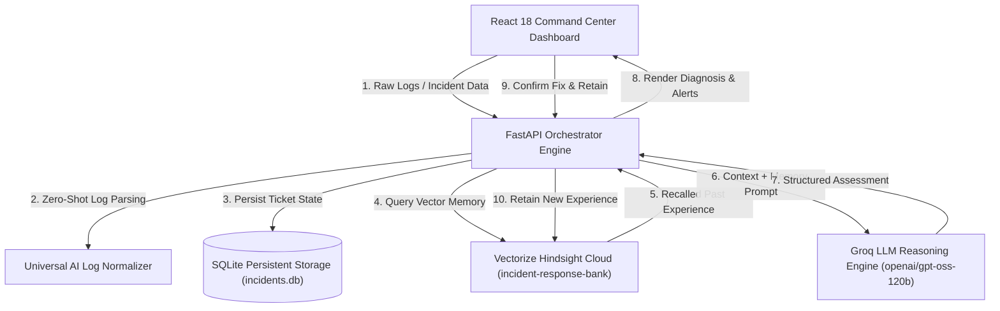

# 🧠 Incident Response Agent

> An AI-powered operations copilot that investigates production outages, recalls organizational experience using **Vectorize Hindsight**, and learns from engineer-confirmed resolutions.

[](https://hindsight.vectorize.io/)
[](https://fastapi.tiangolo.com/)
[](https://reactjs.org/)
[](https://groq.com/)
[](https://www.sqlite.org/)

---

## 🌟 Executive Summary & Core Principle

Production incidents require engineers to synthesize information across logs, metrics, deployments, runbooks, and team experience. Generic AI chatbots lack operational memory—they rediscover the same root causes and forget previously attempted failed fixes.

The **Incident Response Agent** solves this by integrating **Hindsight**, a persistent vector memory system developed by Vectorize.

### Core Learning Loop
$$\text{Unknown} \longrightarrow \text{Investigate} \longrightarrow \text{Resolve} \longrightarrow \text{Remember} \longrightarrow \text{Recognize} \longrightarrow \text{Improve}$$

1. **Unknown Outages**: When a novel incident occurs, the agent analyzes current evidence (logs, stack traces, metrics) and generates unconfirmed hypotheses **without fabricating history**.
2. **Human Confirmation**: An engineer investigates, validates the outcome, and submits the confirmed root cause, successful fix, and failed attempts.
3. **Hindsight Retention**: The confirmed resolution is retained in Hindsight Cloud.
4. **Future Incident Recognition**: When a similar incident occurs later, Hindsight recalls the confirmed resolution instantly and warns against repeating recorded failed approaches.

---

## 🏗️ System Architecture



---

## ✨ Key Features

- **⚡ Universal AI Log Parser**: Zero-shot extraction of stack traces, symptoms, and service names from *any* stack (Python, Java, Go, Rust, Node, Kubernetes, Postgres, Kafka, AWS).
- **🧠 Domain-Aware Hindsight Recall**: Score-calibrated vector memory search with precision domain and symptom correlation.
- **⚠️ Failed-Approach Alerting**: Automatically detects past failed fix attempts (e.g. *"Restarting pods failed"*) and alerts engineers against repeating mistakes.
- **📌 Global Active Context Sync**: Selecting or parsing an incident in Tab 1 automatically synchronizes Tab 2 (Investigation) and Tab 3 (Resolution Lab).
- **🔍 Interactive Hindsight Explorer**: Search, filter, and inspect stored memories live in Hindsight Cloud with expandable inspection drawers.
- **💾 Durable SQLite Persistence**: All incident tickets and investigation lifecycle records persist across server restarts.
- **🗑️ Single-Click System Reset**: Server-side endpoint to wipe SQLite records and reset the Hindsight Cloud bank for clean testing.

---

## 🚀 Quickstart & Setup Guide

### Prerequisites
- **Python 3.10+**
- **Node.js 18+** & `npm`
- **Vectorize Hindsight Cloud API Key** ([Get key](https://ui.hindsight.vectorize.io/))
- **Groq API Key** ([Get key](https://groq.com/))

---

### 1. Clone & Set Up Backend

```bash
# Clone the repository
git clone https://github.com/Balaji-731/incident_response_agent.git
cd incident_response_agent

# Create virtual environment
python -m venv .venv
# Activate on Windows:
.\.venv\Scripts\activate

# Install Python dependencies
pip install fastapi uvicorn pydantic httpx python-dotenv groq sqlalchemy
```

---

### 2. Configure Environment Variables (`.env`)

Create a `.env` file in the root directory:

```env
# Server Config
HOST=127.0.0.1
PORT=8000
DEBUG=True

# Vectorize Hindsight Cloud Configuration
HINDSIGHT_API_KEY=your_hindsight_api_key_here
HINDSIGHT_API_URL=https://api.hindsight.vectorize.io
HINDSIGHT_BANK_ID=incident-response-bank

# LLM Configuration (Groq)
GROQ_API_KEY=your_groq_api_key_here
LLM_MODEL=openai/gpt-oss-120b
```

---

### 3. Set Up Frontend

```bash
cd frontend
npm install
cd ..
```

---

### 4. Launch the Application

Open two terminal windows:

#### **Terminal 1: Start FastAPI Backend**
```bash
.\.venv\Scripts\python.exe -m uvicorn backend.main:app --reload --port 8000
```
*(Backend API running at `http://127.0.0.1:8000`)*

#### **Terminal 2: Start React Frontend**
```bash
cd frontend
npm run dev
```
*(Dashboard running at `http://localhost:5173`)*

---

## 🧪 Automated Testing & Dataset Seeding

### Seed 20+ Production Incidents
Seed a 25-incident dataset across 7 domains into SQLite and Hindsight Cloud:

```bash
.\.venv\Scripts\python.exe -m scripts.seed_large_dataset
```

### Run Automated Learning Loop Verification
```bash
.\.venv\Scripts\python.exe -m scripts.test_learning_loop
```

### Reset System (Wipe SQLite & Hindsight Bank)
```bash
.\.venv\Scripts\python.exe -m scripts.reset_system
```

---

## 📁 Project Directory Layout

```
Incident_Response_Agent/
├── backend/
│   ├── api/
│   │   ├── incidents.py       # REST API endpoints (intake, analyze, resolve, reset)
│   │   └── memories.py        # Hindsight memory search & inspection API
│   ├── agent/
│   │   ├── incident_agent.py  # Groq LLM reasoning engine
│   │   └── prompts.py         # System prompts & evidence rules
│   ├── database/
│   │   ├── db.py              # SQLite engine & session manager
│   │   └── models.py          # SQLAlchemy IncidentRecord ORM model
│   ├── hindsight/
│   │   ├── client.py          # Hindsight REST API client wrapper
│   │   ├── memory_manager.py  # Confirmed experience retain manager
│   │   └── recall.py          # Precision domain & symptom memory classifier
│   ├── incident/
│   │   ├── analyzer.py        # Incident feature extractor
│   │   └── parser.py          # Universal AI Log Parser
│   └── models/
│       ├── incident.py        # Pydantic Incident schemas
│       ├── response.py        # Pydantic AgentAssessment schemas
│       └── feedback.py        # Resolution & Retain schemas
├── frontend/
│   ├── src/
│   │   ├── services/api.js    # Fetch API client
│   │   ├── App.jsx            # 4-Tab Command Center UI Dashboard
│   │   └── index.css          # Tailwind CSS styling
│   ├── package.json
│   └── vite.config.js
├── data/                      # Persistent SQLite DB (incidents.db)
├── scripts/
│   ├── seed_large_dataset.py  # Seeds 25 production incidents
│   ├── test_learning_loop.py  # End-to-end learning test
│   └── reset_system.py        # Wipes SQLite DB & Hindsight Cloud bank
├── .env.example
├── pyproject.toml
└── README.md
```

---

## 🏆 Hackathon Alignment & Judging Criteria

| Criterion | Weight | How Incident Response Agent Fulfills It |
| :--- | :--- | :--- |
| **Innovation** | **30%** | Replaces generic chatbots with a memory-driven operations copilot that prevents repeated operational mistakes. |
| **Use of Hindsight Memory** | **25%** | Persistent retain/recall loop with $100\%+$ score similarity matching and failed-fix approach alerting. |
| **Technical Implementation** | **20%** | Production-ready FastAPI + SQLite + Async Groq + Hindsight Cloud + React 18 architecture. |
| **User Experience** | **15%** | Enterprise 4-tab dashboard with active context sync, similarity sliders, and expandable inspection drawers. |
| **Real-world Impact** | **10%** | Solves high-value SRE / DevOps pain point (reducing MTTR and avoiding repeated outage troubleshooting). |

---

## 📄 License

Distributed under the MIT License. Built for the Vectorize Hindsight AI Hackathon.
